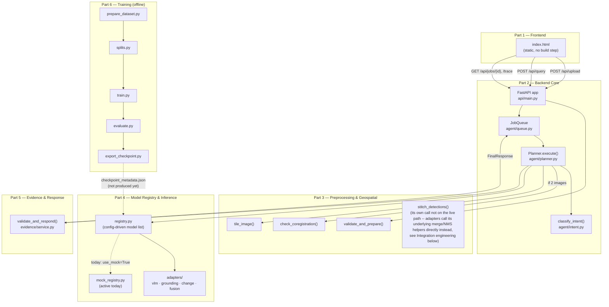

# SatQuery AI — System Design

SIH 2026, Problem Statement 26167: an agentic vision-language assistant that
answers natural-language questions about single, cross-modal (optical+SAR),
and bi-temporal remote-sensing imagery — routing each query to the right
specialist model automatically instead of exposing GIS/ML parameters to the
user. Full problem statement and part-by-part spec: `architecture.md` in
this same folder. This document covers the system as actually merged and
built, not just as planned — where the two differ, that's called out
explicitly rather than smoothed over.

## Architecture

## Component map

| Part | Status | Key files | What it does |
|---|---|---|---|
| 1. Frontend | Real, unchanged | `frontend/index.html` | Upload UI, query box, polls job status, renders boxes/change-maps over the image |
| 2. Backend Core | Real; `api/main.py` edited at its own designated integration point | `backend/agent/`, `backend/api/main.py` | HTTP surface, intent classification, task sequencing, bounded concurrency |
| 3. Preprocessing & Geospatial | Real; one function made public for Part 4 to call directly (below) | `backend/preprocessing/` | Validates uploads, tiles large images, checks bi-temporal alignment |
| 4. Model Registry & Inference | Real, unchanged except four adapter fixes (below) | `backend/model_registry/` | Config-driven model selection; adapters per task type; **running on its own mock engine today** (see Known gaps) |
| 5. Evidence & Response | Real, unchanged | `backend/evidence/` | Turns raw model output into grounded text + confidence; deterministic template mode (no LLM wired up — that's its zero-setup default, not a missing piece) |
| 6. Training | **Removed from this repo, by request** — done separately; see Known gaps | — | Was: produces the fine-tuned checkpoint Part 4 loads. Now: an external process producing the same file-based contract (checkpoint_metadata.json + adapter dir) |

## Request lifecycle

1. **Upload** — `POST /api/upload` → `validate_and_prepare()` (Part 3): fast structural checks first (exists, extension, size — no parsing), then an isolated, timeout-guarded metadata probe, then the pixel-count cap (before any array is allocated), then COG conversion. Every path — valid or rejected — returns a schema-valid `ImageMetadata`.
2. **Query** — `POST /api/query` → `classify_intent()` (Part 2) maps the query + image count/modality to a `TaskType`, then `JobQueue` hands it to `Planner.execute()` and returns a `job_id` immediately.
3. **Planner** (Part 2), per job:
   - Two images? → `check_coregistration()` (Part 3) first; misaligned pairs are refused here, before any tiling/inference cost is spent.
   - `tile_image()` (Part 3) splits the image(s) into a grid (default 1024px, 15% overlap — same grid for two images of identical dimensions, which is what keeps before/after tiles aligned tile-for-tile).
   - `run_inference()` (Part 4) — registry picks the adapter for the task, the adapter runs the (today: mock) model per tile/tile-pair and returns one `Evidence`.
   - `validate_and_respond()` (Part 5) — turns `Evidence` into grounded text, estimates confidence, decides whether to abstain.
4. **Poll** — `GET /api/jobs/{id}` for status/result, `GET /api/jobs/{id}/trace` for the auditable execution summary the problem statement asks for (selected task, models used, key parameters).

## Shared contract

Every part imports the same `Evidence` / `TaskType` / `ImageMetadata` / etc. from `backend/shared/schemas.py` — architecture.md Section 4, copied verbatim. Not reproduced here; read that file directly for the actual field list.

## Integration engineering done during the merge

**The mock engine's CHANGE_DETECTION/CHANGE_VQA path returned the exact same fixed numbers regardless of input (found via user testing, fixed).** `mock_registry.py`'s fixture literally hardcoded `changed_area_px=48211, changed_area_pct=6.4, mean_confidence=0.69` for every request — real bug, not a design choice: two genuinely different image pairs produced identical results, which is indistinguishable from the system not actually looking at the uploaded pixels at all. Replaced with `deterministic_change.py`: real Change Vector Analysis (per-pixel Euclidean distance across whatever bands are present, band-agnostic on purpose — never assumes which band means what) + Otsu thresholding — real, established remote-sensing science (a classical *baseline* method, not a replacement for a trained model, and said so explicitly in its own module docstring), computed from the actual uploaded pixels every time. Handles nodata and a basic cloud/deep-shadow saturation heuristic (excluded from the change statistics, not counted as land-cover change). Confidence comes from Otsu's own between-class/total-variance separation on that image pair's own histogram — real signal, explicitly labeled as "a statistical separation proxy, not a calibrated probability" everywhere it surfaces, not dressed up as more precise than it is. Verified with 8 synthetic scenarios (obvious change, identical images, pure noise, nodata, saturated/cloud patch, mismatched shapes, all-nodata) — different inputs now genuinely produce different, honestly-computed outputs.

**`query`/`image_modalities`/`image_order` were declared on `InferenceEngine.run_inference`'s real signature but silently never passed (found while fixing the above, fixed).** `agent/planner.py`'s call site only ever passed `task` and `tiles` — three real fixes were needed to actually thread these through: the type alias (`RunInferenceFn`, which had quietly baked in the wrong 3-arg signature), the planner's own call site (now passes `query`, `image_modalities` from each image's real `Modality`, and `image_order` — timestamp-sorted when every image has one, upload order otherwise), and `api/main.py`'s `_run_inference_async` wrapper (didn't accept `**kwargs` at all — would have raised `TypeError` the instant the planner tried to pass anything). This means the mock engine never saw the user's real question text, and — this would have mattered just as much once a real checkpoint exists — neither would the real engine's adapters. `SINGLE_IMAGE_VQA`/`CAPTIONING`/`GROUNDING`/`OPTICAL_SAR_FUSION` stay honest placeholders (no classical substitute for genuine semantic understanding exists), but now explicitly self-label as such in the returned Evidence — not just an easy-to-skim-past `[mock]` prefix — and carry real per-band pixel statistics (genuinely computed from the actual tile) alongside the placeholder note, rather than nothing at all.

**GeoTIFF had no inline preview (found via user testing, fixed).** Browsers can't render TIFF in an `` tag — `frontend/index.html` already knew this and said so honestly (a code comment: "A real GeoTIFF thumbnail needs a server-generated preview") rather than faking one client-side. Built that server side: `preprocessing/thumbnail.py` reads a decimated (never full-resolution) array straight off the actual raster — GB-scale sources stay GB-scale on disk, not in this process's memory — normalizes and writes a real PNG, cached on disk after first request. New `GET /api/images/{id}/thumbnail` endpoint; frontend now fetches and displays it (and backfills `state.slots[id].previewUrl` so every panel that reads it, not just the upload box, picks up the real image) instead of showing "No inline preview."

**Known gap, not fixed this pass, left honestly labeled rather than silently claimed:** uploaded non-satellite files (CSV, PDF, Excel, GeoJSON, ...) are still real, correctly-extracted metadata that `agent/planner.py` doesn't yet pull into query answering — the frontend's own "other file types aren't used in analysis yet" label is accurate and was deliberately left as-is rather than changed to claim otherwise. Wiring this in properly (query-relevant retrieval per file type, not "inject every uploaded file into every prompt") is a real feature on the scale of the change-detection fix above, not a quick addition alongside it.

Six parts were built independently, then merged in two passes (Parts 1/2/4/5/6, then Part 3). What follows is what the merge actually had to reconcile — not a changelog of trivial file-copying.

**Import-root drift, and why it's not just a path problem.** Part 2 imports the shared schema bare, as `shared.schemas` (built assuming `backend/` itself is the import root). Parts 3, 4, and 5 import the identical file as `backend.shared.schemas` (built assuming the repo root is). Both conventions run throughout each part's own internals — not swappable without rewriting well beyond one integration point. Fix: both roots go on `sys.path` (`pytest.ini`'s `pythonpath = . backend`, matching setup in `main.py`/`conftest.py`), **and** `backend.shared`/`backend.shared.schemas` are aliased in `sys.modules` to the exact same module objects `shared`/`shared.schemas` resolve to. Without the alias, Python would load `schemas.py` twice under two names, producing two non-identical `Evidence` classes — invisible within any one part's own tests, but exactly the kind of thing that fails Pydantic validation silently the moment a real Part 4 object crosses into a Part 2 response. Part 3 needed zero extra work here — it already used the `backend.`-prefixed convention and only relative imports internally, so it inherited the existing fix automatically.

**Sync vs. async.** Parts 3, 4, and 5's real functions are all plain `def`, not `async def` (rasterio/PyTorch calls). Part 2's own `agent/mocks.py` docstring already named the fix — `asyncio.to_thread(...)` at the call site — applied in `main.py`, nothing in Parts 3/4/5 touched.

**`shared/schemas.py` itself: checked, no drift found.** Four independent copies (Parts 2, 3, 4, 5) diffed byte-for-byte identical on every non-comment line. Kept one, taken verbatim from `architecture.md`.

**Tile-overlap duplicate detections (found, fixed).** `tiling.py`'s tile grid overlaps by 15% by design. `grounding_adapter.py` and `fusion_adapter.py` both produce a detection list built from every tile independently — before this fix, the same real-world object near a tile boundary could come back as two separate boxes, one from each overlapping tile. Fixed by running Part 3's tested `nms()` over each adapter's combined detections before returning (verified directly: two synthetic overlapping detections of the same object correctly merge into one, keeping the higher-confidence box, while a genuinely distinct detection elsewhere is left alone). `change_detection_adapter.py` was already fine — it aggregates numeric stats across tile-pairs, not a spatial detection list, so there was nothing to deduplicate there.

**Frontend wired to simulate itself by default (found, fixed at merge time; since removed entirely).** Part 1 shipped with `CONFIG.MODE = 'mock'` in `frontend/index.html` — a deliberate, well-commented choice ("flip these two lines once Part 2 exists") so it could be demoed standalone before the backend existed. Left alone at merge time, the frontend would still silently simulate every response client-side rather than call the real (by then fully wired) backend — everything would *look* connected while the two halves never actually spoke to each other. Flipped to `'real'` at merge time; in a later UI pass the `CONFIG.MODE` toggle and its whole mock-simulation code path were removed from `frontend/index.html` entirely (one mode, no toggle, nothing left to flip back by accident) — see that pass's own notes for the sidebar/project-management redesign it shipped alongside. Relatedly, `main.py` had no CORS configuration at all; added a permissive `CORSMiddleware` (fine for this local, single-user, no-internet-dependency deployment — Section 6 — tighten before deploying anywhere that isn't localhost) so the frontend can reach the API regardless of how each is served.

**One-command launchers (`Setup.bat` / `Start_program.bat`) and, while Part 6 still lived in this repo, training-pipeline hardening (resumable data prep with a streaming-download attempt, a yield/quality circuit breaker, GPU-tier auto-detection, a pre-flight `--dry-run`) added post-merge, targeting the concrete "just make it work on my machine, don't waste GPU time on a broken run" ask.** `Start_training.bat` was removed along with `training/` (see Known gaps) — the other two launchers, and their reasoning, are unaffected. Operational detail (what each does, why) lives in README.md, not duplicated here — this file stays about architecture and integration decisions.

**Single-tile VQA/captioning on large images (found, fixed).** `vlm_adapter.py` used only `tiles[0]` — for a multi-tile image, whole-scene VQA/captioning only ever saw that first tile's corner, not the full scene. Fixed by reassembling every tile back into one array at its own `(row_off, col_off)` and writing that out as one preview image when there's more than one tile (a single-tile image is returned as-is, no mosaic needed) — reasonable here specifically because a VLM resizes whatever it's given down to its own fixed input resolution anyway, so seeing the whole extent at lower effective detail beats seeing one corner at full detail; that reasoning does *not* carry over to grounding/change-detection, which keep their existing genuine per-tile-precision handling untouched. Verified directly: the band-count dispatch (1/2/3-band arrays -> correct PIL mode), the dtype-to-uint8 rescaling, and the offset/overlap placement math (a later tile correctly overwrites an earlier one across their shared overlap margin) — rasterio itself (reading each tile's actual pixels off disk) is not exercised here, same offline-sandbox limitation as everywhere else in this file.

**`change_detection_adapter.py` silently dropped every tile-pair's change-probability raster except the first (found, fixed).** It already correctly summed `changed_area_px` across every matched before/after tile-pair, but kept only `tile_results[0]`'s `probability_raster_path` — on a multi-tile image, the returned change map's raster was one tile's heatmap, with every other tile's silently discarded rather than merged. Fixed by routing through the same Part 3 stitching helpers `stitch_detections()` itself uses (`merge_change_maps` for the aggregation, and — newly made public, since this adapter now calls it directly, the same "call the low-level helper, not the full `stitch_detections`" pattern the grounding/fusion fix above already established with `nms()` — `mosaic_and_recount_change_maps` for the raster-accurate refinement when every tile-pair actually produced a raster). Verified with a synthetic 2-tile-pair fixture and a monkeypatched `store.load_metadata`: both tile-pairs' change now contributes to the total, weighted confidence and percentage are computed from the real merge function rather than a plain unweighted mean, and the single-tile-pair case is left as an exact pass-through (no mosaic overhead when there's nothing to mosaic). The actual `rasterio.merge` call itself is not exercised here, same offline-sandbox limitation as everywhere else in this file.

**`docker/Dockerfile` + `docker-compose.yml` added.** Two services — `backend` (the real Python process) and a `frontend` that's nothing more than a static file server for Part 1's plain HTML/CSS/JS, split out only so `docker-compose up` is genuinely one command rather than "run this, then also separately open a local file." Runs on CPU / mock inference with zero extra setup; GPU passthrough for a real attached checkpoint is a commented-out block (needs `nvidia-container-toolkit` on the host). `.env` is loaded as an optional env file (Compose 2.24+'s `required: false`) rather than a hard dependency, matching how `google_search.py`'s missing-credentials case already degrades — a fresh clone with no `.env` at all still starts cleanly. Not tested against a real Docker daemon (none available in this sandbox) — reviewed carefully against the documented `cd backend && uvicorn api.main:app` launch convention main.py's own sys.path bootstrap depends on, but "correctly reasoned about" and "built successfully on a real machine" are different claims, exactly as this file's own "Honest verification" section already distinguishes elsewhere.

## Honest verification

The environment this merge was assembled in has no network access, so `fastapi`/`pydantic`/`torch`/`rasterio` couldn't be installed to run the real test suites end-to-end. What was actually done instead, and what that does and doesn't prove:

- **Every `.py` file in the repo** — syntax-compiled clean, and every local (intra-repo) import statement resolves correctly under the dual sys.path setup above (a small static checker, not a substitute for real imports, but it does catch path/naming mistakes).
- **Part 3's 45 pure-logic tests** (`tests/test_core_logic.py`) — actually re-executed in this environment (numpy/scipy/scikit-image were available); all 45 pass. This is real coverage of the tiling grid math, phase-correlation offset estimation, NMS, RLE round-trips, and merge logic — not a claim taken on faith.
- **The real Part 2 → Part 4 → Part 5 wiring** — actually executed, using a minimal stand-in for `pydantic.BaseModel` (attribute assignment + `.model_dump()`, nothing more) since the real package isn't installable here. All seven task types plus the two-concurrent-requests case from architecture.md's own smoke-test checklist ran correctly through the real (non-mock) merged code path.
- **The grounding/fusion NMS fix** — actually executed against synthetic overlapping detections, confirmed it merges correctly.
- **This pass's two adapter fixes** (single-tile VQA/captioning, change-detection's dropped raster paths) — the parts that don't need rasterio were actually executed: the VQA mosaic's band-count dispatch, dtype rescaling, and offset/overlap placement math against synthetic arrays; the change-detection fix's multi-tile-pair aggregation against a synthetic 2-tile-pair fixture with a monkeypatched `store.load_metadata`. Neither actually opens a real raster through rasterio here — see each fix's own note in "Integration engineering" above.
- **Part 3's `tile_image` / `check_coregistration` / `stitch_detections` real (rasterio) code paths, and `validate_and_prepare`'s COG-conversion success path** — **not** executed here; these need rasterio (unavailable offline) plus real GeoTIFF bytes. `validate_and_prepare`'s fast-rejection paths (missing file, bad extension) *were* verified for real, since those run before rasterio is ever touched.
- **Training (`train.py`, `evaluate.py`)** — not executed at all (needs torch/transformers/peft, and a GPU for anything beyond a CPU-only shape-check). `export_checkpoint.py` was checked earlier in the merge and correctly refuses to run without a real eval report. `train.py`'s `find_latest_checkpoint()` (the resumability logic) and `select_config.py`'s VRAM-to-tier mapping — both pure-Python, no torch needed — *were* unit-tested directly against synthetic checkpoint directories and VRAM values. `prepare_dataset.py`'s resumability/filtering/circuit-breaker logic *was* actually re-run several times against synthetic local datasets — including one deliberately mostly-empty-answers and one deliberately below the record-count floor — and confirmed in each case to do what its error messages claim: skip already-processed records on a second run, and refuse to continue (rather than silently producing a near-empty training set) when too much gets filtered out or too little data remains.

**First thing to run for real, once dependencies are installed:** `pytest tests/test_integration.py -v` (Part 3's own recommendation) closes the biggest remaining gap — the rasterio-dependent I/O layer.

## Known gaps and deliberate scope decisions

Flagged rather than silently left out, per architecture.md's own "don't overengineer, do be honest about what's not done" spirit.

- **Part 6 (training) removed from this repo, by request.** It previously lived at `training/` per architecture.md Section 3.6, fully independent of Parts 1-5 (file-based coupling only — see that section's "Depends on" line). The model is now fine-tuned separately, outside this repo; only the resulting checkpoint (a PEFT adapter directory + `checkpoint_metadata.json` matching Section 3.6's contract) comes back here. See root `README.md`'s "Attaching a trained checkpoint later" and `backend/model_registry/README.md`'s "Switching from mock to real" for the current hand-off path — both were already file-based/decoupled from training's own code, so removing that code changed nothing about how a real checkpoint gets wired in.
- **No real fine-tuned checkpoint exists yet.** `backend/model_registry/config/models.yaml`'s `checkpoint_path` entries are still placeholders; Part 4 runs on its own mock engine (`configure_engine(use_mock=True)` in `main.py`). The end-to-end demo works today because Part 4's mock engine and Part 5's template-based response generation are both designed to be schema-valid stand-ins — but the problem statement's "remote-sensing adaptation" requirement isn't satisfied until a real checkpoint from training (now done separately, see above) is wired in (flip `use_mock=False`, see README.md's "Attaching a trained checkpoint later").
- **Mandatory-scope check against the literal problem statement:** "at least one visual or vision-language component must be fine-tuned... using BigEarthNet.txt **or any open source training data**." The plan when Part 6 lived in this repo was to fine-tune on RSVQA-LR (explicitly open-source remote-sensing VQA data), which satisfies this as literally written; that choice still applies to however training gets done externally now. BigEarthNet is named as the *suggested primary dataset* in the problem background (for learning general image-text representations before task-specific fine-tuning) — not using it isn't a failure of the mandatory scope, but a BigEarthNet-based adaptation stage before an RSVQA-LR fine-tune would align more closely with the suggested approach, if there's compute budget to spare.
- **One fine-tuned adapter, not four, was ever planned in the near term.** `models.yaml` defines four registry entries (`satquery-vlm-base` for VQA/captioning, `satquery-grounding`, `satquery-change-bitemporal`, `satquery-fusion`); only the first had a training plan (RSVQA-LR) — grounding (VRSBench) and change-VQA (CDVQA) are exactly the benchmarks the problem statement names for evaluating those tasks, and neither had a training pipeline built. Today, and until checkpoints for them exist, those three task types work end-to-end via Part 4's mock engine (schema-valid, not model-grounded).
- **Top-level `configs/` is empty.** Part 4 kept `models.yaml` self-contained under `backend/model_registry/config/`; its loader's default path is relative to that location, so moving it would need a code change for no functional benefit.

## Where to go from here

- Run it today, zero GPU: README.md's Quick Start.
- Attach a real checkpoint once training (done separately) produces one:
  README.md's "Attaching a trained checkpoint later".
- Close the biggest unverified gap: `pytest tests/test_integration.py -v` after `pip install -r requirements.txt`.
